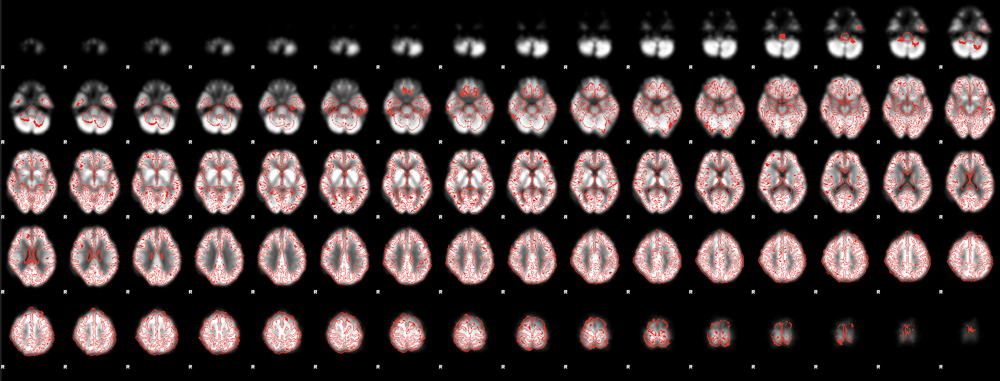

PET Image Analysis
====================

**1. Overview:**

OPETIA provides a user-friendly interface for the pre-processing of dynamic/static PET images, which is essential for accurate analysis in multimodal neuroimaging studies. The tool automates the entire process, ensuring that users do not need extensive technical knowledge to perform complex image analyses. However, all the details of the image pre-processing are provided and can be modified by the user if needed.

Since most PET images are dynamic and contain several volumes, OPETIA by default considers the input image dynamic. However, OPETIA automatically detects the number of volumes in the image. In case of static PET image, OPETIA automatically implements functions for static PET images.

*Input data:*

- PET volumes (vol0000.nii.gz, vol0001.nii.gz, etc)

*Pre-processing steps:*

- Skull stripping of all PET vols (brain extraction)
- Co-registration of the first PET vol to the native T1 space (6 degrees of freedom)
- Co-registration of the remaining PET vols to the results of previous stage (6 degrees of freedom)
- Summing all resulting vols to create a static PET image
- Co-registration from native PET to native T1 space (6 degrees of freedom)
- Non-linear registration to the MNI-152 template (2x2x2mm voxel size)(12 degrees of freedom followed by >12 degrees of freedom)
- Smoothing to increase the signal-to-noise ratio (optional but recommended)
- Applying a threshold to remove unnecessary tissue boundries (optional)
- Gray matter (GM), white matter (WM), and cerebrospinal fluid (CSF) segmentation

**2. Running the PET Pre-processing:**

From OPETIA, run the ``PET image pre-processing`` tool.

.. image:: images/OPETIA_PET.png
   :alt:  Image
   :width: 400px
   :align: center

.. raw:: html

         

All needed to be done is to input the path to the folder containing the PET volumes (data/subject1), preferably check the ``Smooth the PET image`` option, and click on ``Process``. All the parameters will be set automatically.

.. admonition:: Note

   The Terminal prints the log of the pre-processing. If there are any errors, you can read about them in the Terminal.

**3. Output files:**

All the **outputs** will be saved in the folder ``data/subject1/OPETIA_output`` (automatically created). These include:

- ``PET_brain_std.nii.gz``: The static skull-stripped PET image in the MNI-152 space.
- ``PET_brain.nii.gz``: The static skull-stripped PET image, co-registered to the native T1 space.

**4. Quality Control:**

By pressing the ``Show processed image`` button, an image will appear containing the MNI-152 template on the background and the pre-processes T1 image as an overlay. The user can visually inspect the quality of the pre-processed image.

.. raw:: html

         

**5. Advanced Options:**

*Brain extraction:*

- ``Fractional intensity threshold``: The threshold (-f) for the brain extraction. The default value is 0.5, and it ranges between 0 and 1. The smaller the value, the larger the brain mask. If 0.5 leads to not missing some brain parts, try smaller values such as 0.4 or 0.3.
- ``Vertical gradient``: The vertical gradient (-g) for the brain extraction. The default value is 0. and it ranges between -1 and 1. Negative values (such as -0.2) includes more brain tissuesat the top (superior). Positive values (such as 0.2) includes more brain tissues at the bottom (inferior).
- ``Function/modality``: The modality for brain extraction. By default, ``Standard brain extraction using bet2`` is selected. If the image contains nech and face, use the ``Biasfield and nech cleanup`` option. It might take a longer time to extract the brain compared to bet2.

*Registration (native structural space to tandard space):*

- ``Brain extracted T1 in native space``: This image is the result of the analysis of MRI image using OPETIA. The software automatically detects the file path for the co-registration of PET to T1.
- ``Standard template``: This is the standard template to which the native structural image will be registered. The default value is ``MNI152_T1_2mm_brain.nii.gz``. You can change it to any other template, such as ``MNI152_T1_1mm_brain.nii.gz``. The template is located at ``OPETIA/Templates``.
- ``PET to T1 registration model``: degrees of freedom for the co-registration of PET to T1.
- ``PET to T1 cost function``: The cost function for the co-registration of PET to T1.
- ``PET to T1 interpolation method``: The interpolation method for the co-registration of PET to T1.

*Increase image signal to noise ratio*:
- ``Smooth the PET image``: Option to smooth the PET image using a default value of 5mm FWHM (recommended).
- ``Threshold the image``: Option to thrshold the PET image to remove unnecesary image boundries.

.. admonition:: Note
    
    You need to be careful with changing the standard space template. OPETIA provides tools that segments the brain into ROIs and extracts features from these regions. The ROIs incorporated in OPETIA are in the MNI152 2mm space. If you change the template to a different one, you need to make sure that the ROIs are also in the same space by modifying the files and images.

