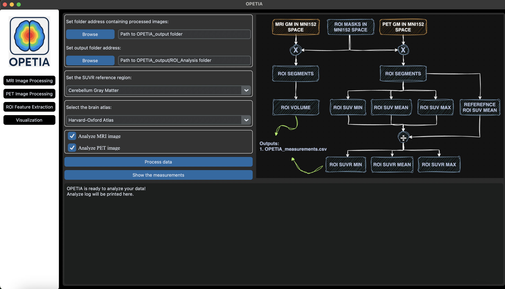
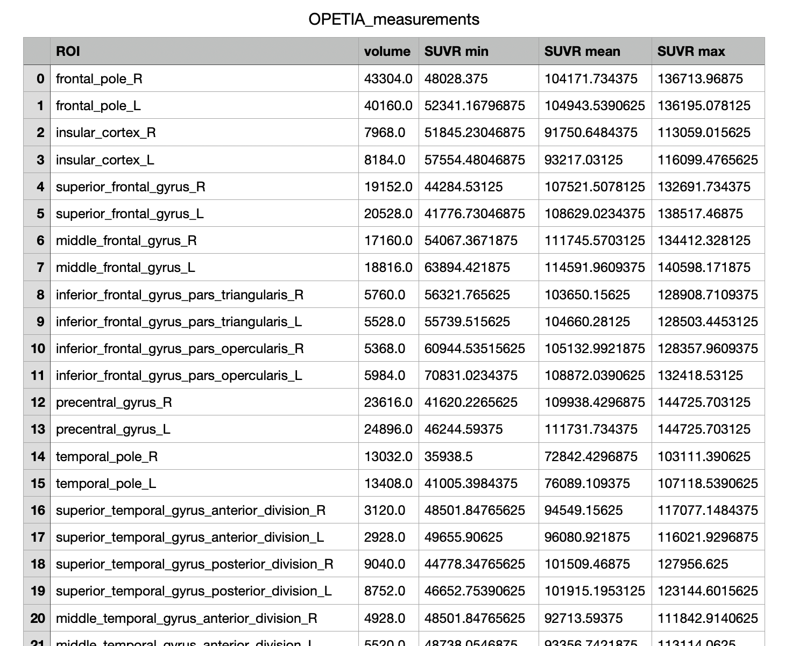

Feature extraction
=========================

**1. Overview:**

OPETIA provides a user-friendly interface for the quantification of the PET and MRI images and feature extraction. The software segments the bain into 115 ROIs (96 cortical and 19 subcortical ROIs) and extracts image features from each ROI.

.. admonition:: Note

    If your data does not contain PET images, OPETIA allows to extraction of MRI images features alone.
    However, PET feature extraction requires a T1-weighted MRI image processed by OPETIA.

*Input:*

- Folder containing the results of MRI and PET pre-processing (data/subject1/OPETIA_output)

*Outputs:*

All the outputs will be saved in ``data/subject1/OPETIA_output/ROI_analysis`` and they include:

- Images of 96 cortical ROIs (according to the Harvard-Oxford brain atlas)
- Images of 19 subcortical ROIs (according to the Harvard-Oxford brain atlas)
- Cerebral volume measurement (mm3) from each ROI
- Standardized Uptake Value Ratio (SUVR) from each ROI (mean, min, max)

**2. Running the ROI analysis:**

From OPETIA, run the ``ROI Feature Extraction`` tool.

.. raw:: html

         

*Setting the parameters:*

1. Before running the processing, you need to select the SUVR reference region. The choices are:

* Cerebellum
* Cerebellum Gray Matter (default)
* Global Gray Matter
* Global White Matter
* Pons
* Whole Brain

2. If your data contains both T1-weighted MRI and PET images, you can select the checkboxes. If not, you can only select the image modality that your data has or you want to quantify.

Now, you can press the ``Process data`` button to start the analysis.

**3. Outputs:**

All the outputs will be saved in ``data/subject1/OPETIA_output/ROI_analysis`` and they include:

- ``OPETIA_measurements.csv``: A CSV file containing the volume (mm3) and SUVR (mean, min, max) from each ROI.
- ``MRI_Cortical_ROIs``: A folder containing images of 96 cortical ROIs (according to the Harvard-Oxford brain atlas).
- ``MRI_Subcortical_ROIs``: A folder containing images of 19 subcortical ROIs (according to the Harvard-Oxford brain atlas).
- ``PET_Cortical_ROIs``: A folder containing images of 96 cortical ROIs (according to the Harvard-Oxford brain atlas).
- ``PET_Subcortical_ROIs``: A folder containing images of 19 subcortical ROIs (according to the Harvard-Oxford brain atlas).

**4. Results:**

By pressing the ``Show the measurements`` button, a table will appear containing the volume (mm3) and SUVR (mean, min, max) from each ROI.

In the table, *R* and *L* refere to the *Right* and *Left* brain hemispheres, respectively.

.. raw:: html

         

