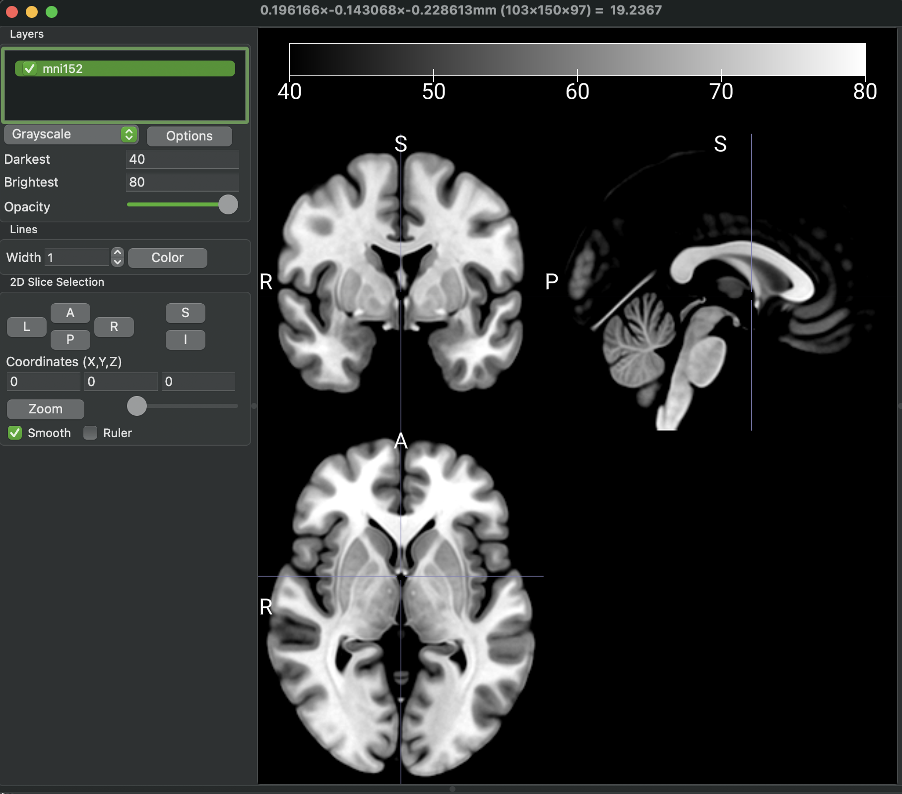

Making the data ready
=========================

**1. Overview:**

Before using OPETIA, it is essential to prepare your data correctly. This involves ensuring that your MRI images are in the NIfTI format and that they are organized in a way that OPETIA can process them effectively.

If your MRI images are in DICOM format, there are several ways to convert them to NIfTI format. However, it is suggested to use the ``MRIcroGL`` software: ``OPETIA: Visualization`` tool.
Your files need to look like this:

.. code-block:: text

   /path/to/data/
   ├── subject1/
   │   ├── folder containing DICOM files of MRI
   │   └── folder containing DICOM files of PET
   ├── subject2/
   │   ├── folder containing DICOM files of MRI
   │   └── folder containing DICOM files of PET
   └── subject3/
       ├── folder containing DICOM files of MRI
       └── folder containing DICOM files of PET

.. admonition:: Note

    1. It is not essential that the DICOM files are immediately in the folder. They can be in subfolders as well, as long as all the DICOM files are in the same folder.
    
    2. The folder names can be anything, and there is no need to rename the folders to MRI and PET. The folder names should not contain any special characters or spaces to avoid issues during processing.

**2. Converting DICOM to NIfTI:**

MRIcroGL is available within OPETIA (``OPETIA: Visualization`` tool).

.. raw:: html

         

Open ``OPETIA: Visualization`` tool, then go to ``Import > Convert DICOM to NIfTI``. In the new window, set the parameters as follows:

- Output Filename: ``%i_%p_%d_%z``
- Output Directory: ``Save NIfTI image to the same folder as DICOM``
- Output Format: ``Compressed NIfTI (.nii.gz)``
- Create BIDS sidecar: ``None``
- Advanced: ``All uncheck``

After setting the parameters, click on ``Select folder to convert`` and **select the parent folder (/data/subject1)**. Therefore, all the DICOM files will convert into NIfTI files and saved all together in the subject folder.

Now from the file names, you can identify the MRI image and the dynamic/static PET image.

Please rename the MRI image to ``T1.nii.gz`` and the dynamic PET image to ``PET.nii.gz``.

.. code-block:: text

   /path/to/data/
   ├── subject1/
   │   ├── folder containing DICOM files of MRI
   │   └── folder containing DICOM files of PET
   │   └── T1.nii.gz
   │   └── PET.nii.gz

.. admonition:: Note

   The PET image can be either dynamic or static. OPETIA will automatically detect the type of PET image and process it accordingly.

