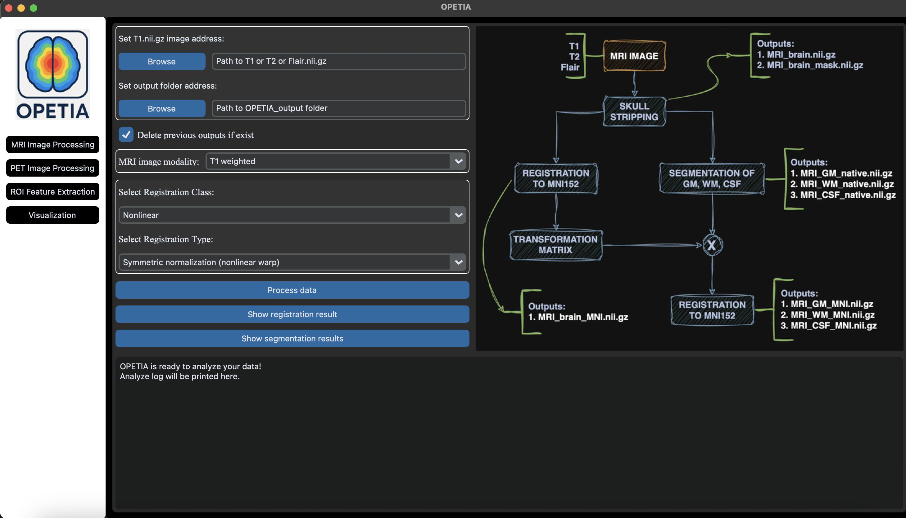

Installation
======================

OPETIA can be installed on macOS/Windows/Ubuntu systems using the following steps:

1. **Install Conda**

   You can install Conda from the official website:

   `Conda Installation Guide <https://www.anaconda.com/download>`_

   (Choose Miniconda for your OS: Windows, macOS, or Linux.)

   Check if Conda is installed correctly by running the following command in your terminal (macos/Ubuntu) or Anaconda Prompt (Windows):

   .. code-block:: bash

      conda --version

2. **Download OPETIA**

   You can download OPETIA from its GitHub repository by running the following command in your terminal:

   .. code-block:: bash

      git clone https://github.com/taha-parsayan/OPETIA.git
      cd OPETIA

3. **Install the packages**

Run the following command in your terminal to install the required packages:

   .. code-block:: bash

      conda env create -f environment.yml

4. **Run OPETIA**

   Activate the OPETIA environment by running the following command in your terminal:

   .. code-block:: bash

      conda activate OPETIA

   Then, run OPETIA by executing the following command in your terminal:

   .. code-block:: bash

      python main.py

   You should see the OPETIA interface as shown below:

.. raw:: html

     
