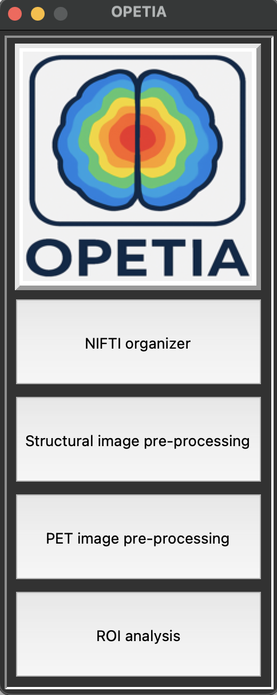

Installation on macOS
======================

OPETIA can be installed on macOS systems using the following steps:

1. **Install Python 3.8 or higher**

Ensure you have Python installed on your system. You can check your Python version by running in a terminal:

.. code-block:: bash

   python3 --version

If Python is not installed, you can install it using `Homebrew <https://brew.sh>`_:

.. code-block:: bash

   brew update
   brew install python@3.13

2. **Install FSL**

OPETIA relies on FSL for image processing. You can install FSL by following the instructions on the FSL website:  
`FSL Installation Guide <https://fsl.fmrib.ox.ac.uk/fsl/fslwiki/FslInstallation>`_.

3. **Clone the OPETIA Repository**

Clone the OPETIA repository from GitHub:

.. code-block:: bash

   git clone https://github.com/taha-parsayan/OPETIA.git

4. **Navigate to the OPETIA Directory**

Change to the OPETIA directory:

.. code-block:: bash

   cd OPETIA

5. **Run OPETIA**

You can run OPETIA by executing the following command:

.. code-block:: bash

   python OPETIA.py

This will launch the OPETIA graphical user interface.

.. raw:: html

     
