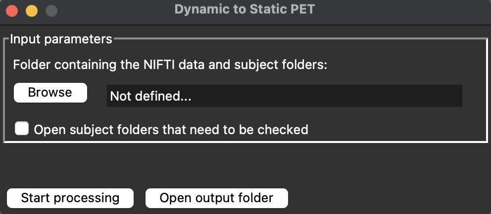

Making the data ready
=========================

**1. Overview:**

Before using OPETIA, it is essential to prepare your data correctly. This involves ensuring that your MRI images are in the NIfTI format and that they are organized in a way that OPETIA can process them effectively.

If your MRI images are in DICOM format, there are several ways to convert them to NIfTI format. However, it is suggested to use the ``MRIcroGL`` software combined with the ``OPETIA: NIFTI Organizer`` tool. ``MRIcroGL`` provides tools for the conversion, and ``NIFTI organizer`` helps to put all the converted images into their corresponding subject folder and renaming them to T1.nii.gz and PET.nii.gz. In case of dynamic PET, the ``NIFTI organizer`` splits all the volumes and saves them in separate image files. The whole process in OPETIA is fully automated. At the end, OPETIA reports if some of the files could not be relocated, renamed, or splitted.

Your files need to look like this:

.. code-block:: text

   /path/to/data/
   ├── subject1/
   │   ├── folder containing DICOM files of MRI
   │   └── folder containing DICOM files of PET
   ├── subject2/
   │   ├── folder containing DICOM files of MRI
   │   └── folder containing DICOM files of PET
   └── subject3/
       ├── folder containing DICOM files of MRI
       └── folder containing DICOM files of PET

.. admonition:: Note

    1. It is not essential that the DICOM files are immediately in the folder. They can be in subfolders as well, as long as all the DICOM files are in the same folder.
    
    2. The folder names can be anything, and there is no need to rename the folders to MRI and PET. The folder names should not contain any special characters or spaces to avoid issues during processing.

**2. Converting DICOM to NIfTI:**

MRIcroGL is available for download from its official website:

`MRIcroGM for Ubuntu and macOS <https://www.nitrc.org/projects/mricrogl>`_

.. image:: images/MRIcroGL_main.png
   :alt:  Image
   :width: 400px
   :align: center

.. raw:: html

         

Once the software is installed, go to ``Import > Convert DICOM to NIfTI``. In the new window, set the parameters as follows:

- Output Filename: ``%i_%p_%d_%z``
- Output Directory: ``Save NIfTI image to the same folder as DICOM``
- Output Format: ``Compressed NIfTI (.nii.gz)``
- Create BIDS sidecar: ``None``
- Advanced: ``All uncheck``

After setting the parameters, click on ``Select folder to convert`` and **select the parent folder containing all subject folders (/data)**. Therefore, all the DICOM files will convert into NIfTI files and saved all together in the data folder.

Now we need to put the images in their subject folders and organize them.

**3. NIFTI organizer**

From OPETIA, open the ``NIFTI organizer`` tool.

.. raw:: html

         

Click on ``Browse`` and select the ``/data`` folder containing the subject folders and the converted NIfTI images. After clicking on the ``Start processing``, OPETIA will:

- Put all the NIfTI images into their corresponding subject folder.
- Rename the image files into ``T1.nii.gz`` and ``PET_Dynamic.nii.gz``.
- Split the dynamic PET images into separate image files as vol0000.nii.gz, vol0001.nii.gz, etc.

.. code-block:: text

   /path/to/data/
   ├── subject1/
   │   ├── folder containing DICOM files of MRI
   │   └── folder containing DICOM files of PET
   │   └── T1.nii.gz
   │   └── PET_Dynamic.nii.gz
   │   └── vol0000.nii.gz
   │   └── vol0001.nii.gz
   │   └── vol0002.nii.gz
   │   └── vol0003.nii.gz

.. admonition:: Note

    1. The Terminal shows a log of all the stages of OPETIA data processing.

    2. If some of the files cannot be relocated or renamed, a list of thse files will be provided in the Terminal. You need to manually organize these files.

    3. By selecting the ``Open subject folders that need to be checked``, folders containing the files that need to be manually organized will be opened so that you can more easily organize them.