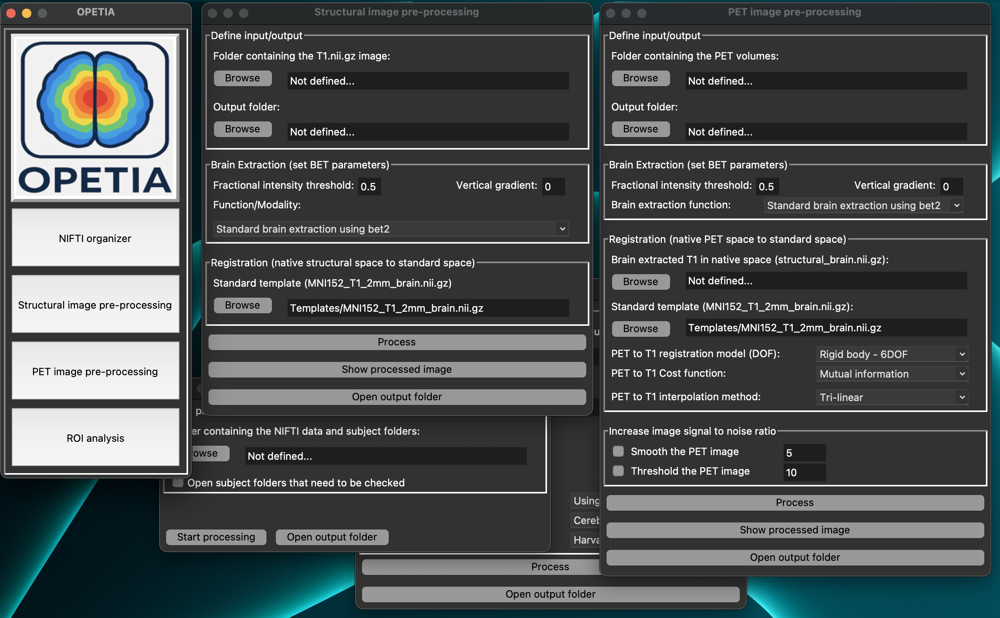

What is OPETIA?
====================

.. raw:: html

         

Advanced Magnetic Resonance Imaging (MRI) and Positron Emission Tomography (PET) analysis provide precise information on brain structure and function for diagnosis and treatment. However, most clinical software lacks accurate quantification, is complicated to use, or does not provide PET image analysis. **FSL** is a widely used toolbox which provides comprehensive functions for the analysis of MRI images, but it lacks functions for the analysis of PET images.

Therefore, we developed **OPETIA (Odense-Oxford PET Image Analysis)**, a user-friendly toolbox based on FSL and Python, which automates multimodal neuroimage pre-processing and calculates SUV, SUVR, and cerebral volume in regions of interest (ROI). We validated OPETIA using FDG PET and MRI data from healthy controls and Alzheimer’s patients in the ADNI dataset, comparing results with SPM12.

**OPETIA provides:**

- A user-friendly interface for multimodal neuroimage preprocessing where all parameters are set automatically, therefore you are not required to have any technical or image analysis knowledge.
- Automatic relocation of the DICOM-to-NIfTI converted images to the subject's folders and renaming them to T1 and PET.
- Automatic pre-processing of the MRI images.
- Automatic pre-processing of statisc/dynamic PET images (dynamic PET images are converted to static PET in the T1 space).
- Automatic identification of 115 ROIs according to the Harvard-Oxford brain atlas.
- Automatic calculation of SUV, SUVR, and cerebral volume in the ROIs.
========

**Input Data:**

- Static/dynamic PET image
- T1-weighted MRI image

**Output Data:**

- Separate images for each ROI according to the Harvard-Oxford brain atlas (115 ROIs) 
- Standardized Uptake Value (SUV) for 115 ROIs: mean, min, max, SD
- Standardized Uptake Value Ratio (SUVR) for 115 ROIs: mean, min, max, SD
- Cerebral Volume for 115 ROIs
