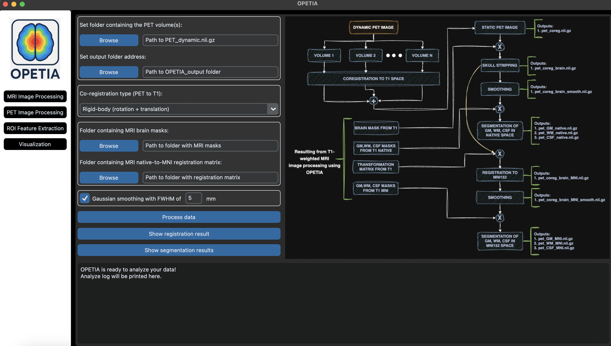

What is OPETIA?
====================

.. raw:: html

         

.. admonition:: Cite OPETIA

   You are kindly asked to cite the following paper when using OPETIA in your work:

   `OPETIA Publication in NeuroImage <https://www.sciencedirect.com/science/article/pii/S1053811925002812>`_

   Thank you!

OPETIA is a user-friendly PET/MRI (Positron Emission Tomography / Magnetic Resonance Imaging) image analysis software, developed using Python for accurate brain image quantification.

OPETIA can be run on:
- Windows
- Linux Ubuntu
- MacOS

========

**OPETIA provides:**

- Structural (MRI) image processing
- Functional (PET) image processing (static or dynamic)
- ROI analysis: to calculate SUVR and cortical volume for 115 ROIs
- MRIcroGL: for converting DICOM images to nifty images, and also for visualization.

Every tool within OPETIA is provided with the flowchart of the data processing, including the input data and the output data.
Additionally, the log box within OPETIA prints the data processing stages for monitoring and error handling.

========

**Supporting Systems:**

 - Windows 11
 - MacOS
 - Ubuntu

========

**Input Data:**

- Static/dynamic PET image
- T1-weighted/T2-weighted/Flair MRI image

**Output Data:**

- Separate images for each ROI according to the Harvard-Oxford brain atlas (115 ROIs) 
- Standardized Uptake Value Ratio (SUVR) for 115 ROIs: mean, min, max
- Cerebral Volume for 115 ROIs

.. admonition:: OPETIA – New Release Highlights

   - Added dedicated processing pipelines for dynamic PET imaging.
   - Integrated Python-based neuroimaging libraries (ANTs, NiBabel, NumPy, Matplotlib) to support data processing aligned with standard FSL workflows.
   - Enabled cross-platform support, allowing OPETIA to run on Windows, macOS, and Ubuntu.
   - Unified the user experience by consolidating all tools into a single, consistent graphical user interface.
   - Integrated MRIcroGL for advanced image visualization, including built-in DICOM-to-NIfTI conversion.
   - Introduced a logging panel to display processing steps, execution status, and error messages in real time.
   - Added a visual flowchart of the data processing pipeline to improve transparency and user understanding.

